# General considerations
This solurion is a demonstration of microservices architecture using Dapr for inter-service communication.
For using dapr, you need to have Dapr installed and running on your local machine or in your cloud environment.
Also docker is used to containerize the microservices for easy deployment and scalability.

# Introspect1B overview
Introspect1B solution includes 2 microservices that are separated projects.
Solution strucure contains the following folders and projects:
1. ProductService project - a microservice that manages products and publishes events when a product is created.
1. OrderService project - a microservice that subscribes to ProductService events to demonstrate communication between microservices using Dapr.
1. dapr folder - contains Dapr components configuration files for pub/sub and state store.
1. Documentation folder - contains images files for used in README.md documentation.
1. Solution folder important files:
	- docker-compose.yml file that defines the services and their configurations for running the microservices in Docker containers.
	- README.md file that provides an overview of the solution, microservices, and instructions for local setup and deployment.
	- Introspect1B.sln file that is the solution file for Visual Studio, containing references to the ProductService and OrderService projects.

# ProductService Microservice Documentation
ProductService microservice is a RESTful API that provides product related functionalities. It allows users to manage products, including creating, updating, retrieving, and deleting product information.
It provides a Swagger UI for easy API exploration and testing.
ProductService Create endpoint use Dapr to publish events to a message broker when a product is created.
This allows other services, such as OrderService, to subscribe to these events and perform actions based on product availability.

Also, it is containerized using Docker for easy deployment and scalability. 
Please reffer to the [Dockerfile](ProductService/Dockerfile) file code that contains documented step by step configuration to containerize the Product service.

For detaild documentation for ProductService implementation and please refer to the [StepByStepImplementation.md](ProductService/Documentation/StepByStepImplementation.md) file.

# OrderService Microservice Documentation
OrderService microservice is a RESTful API that subscribes to ProductService events to demonstrate communication between microservices using Dapr. 
It provides a Swagger UI for easy API exploration and testing.

OrderService is also containerized using Docker for easy deployment and scalability.
Please refer to the [Dockerfile](OrderService/Dockerfile) file code that contains documented step by step configuration to containerize the Order service.

For detailed documentation for OrderService implementation please refer to the [StepByStepImplementation.md](OrderService/Documentation/StepByStepImplementation.md) file.


# Local setup considerations
### Prerequisites
1. Clone the repository to your local machine.
1. Install Visual Studio 2022 on local machine and open the solution file `Introspect1B.sln` in Visual Studio.
1. Build the solution to restore all NuGet packages and dependencies.
1. Install Dapr and Docker on your local machine as described below.

### Docker Setup on Local machine
1. Ensure you have Docker installedon your machine. You can follow the [Docker installation guide](https://docs.docker.com/get-docker/) for instructions.

### Dapr Setup on Local machine
1. Ensure you have Dapr installed and initialized on your machine. You can follow the [Dapr installation guide](https://docs.dapr.io/getting-started/) for instructions.
1. Open a terminal or command prompt
1. Install Dapr CLI if you haven't already. You can download it from the [Dapr CLI installation page](https://docs.dapr.io/getting-started/install-dapr-cli/).
1. Initialize Dapr in your local environment by running the following command:
   ```
   dapr init
   ```		
	This command sets up the necessary components for Dapr to run locally, including a Redis state store and Pub/Sub component. 
Check your docker containers to ensure that Dapr components are running correctly on local machine.
  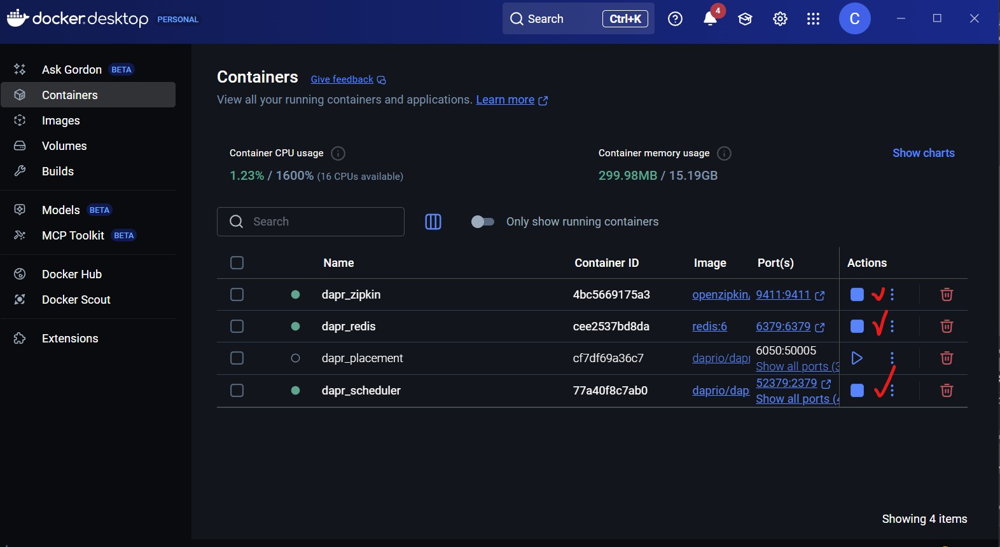

## Run and Test the Microservices Locally 

### Local Run ProductService With Dapr
Open a terminal under solution folder and navigate to the ProductService project directory. 
Run the following command to start the ProductService with Dapr:
```powershell
dapr run --app-id productservice --app-port 5125 --components-path "../dapr/components" -- dotnet run
```
This command starts the ProductService application with Dapr, allowing it to communicate with other services and utilize Dapr features.

### Accessing the Product Service with Dapr
You can use Swagger UI to test the ProductService API endpoints. Open your web browser and navigate to:
```
https://localhost:5125/swagger/index.html
```

### Local Run OrderService With Dapr
Open a terminal under solution folder and navigate to the OrderService project directory. 
Run the following command to start un the OrderService with Dapr:
```powershell
dapr run --app-id orderservice --app-port 5146 --components-path "../dapr/components" -- dotnet run
```
### Accessing the Order Service
You can use Swagger UI to test the OrderService API endpoints. Open your web browser and navigate to:
```
https://localhost:5146/swagger/index.html
```

## Test communication between ProductService and OrderService using Dapr on local
You can test the communication between ProductService and OrderService using Dapr by invoking the endpoints defined in the ProductService API. 
In Swagger UI, go to create endpoint and create a product. 
### Example HTTP Requests for Create a Product
```http
POST https://localhost:5146/api/products
Content-Type: application/json

{
  "id": 11,
  "name": "Procuct check communication",
  "price": 1,
  "stock": 3,
}
```
The above request creates a new product in the ProductService. 
After the product is created, the ProductService will publish an event to Dapr pub/sub, which can be consumed by the OrderService and a message with product details will be logged in the OrderService console as in immage below.
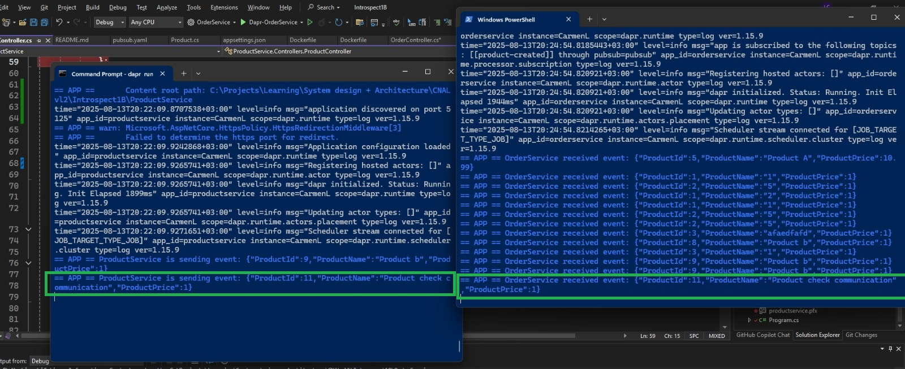

## Run and Test the Microservices from Docker on Local machine
1. Open a terminal under solution folder run docker compose up command to build and run the microservices in Docker containers:
   ```powershell
   docker compose up --build
   ```
   This command builds the Docker images for both ProductService and OrderService and starts the containers.
Your terminal should look like in immage below:
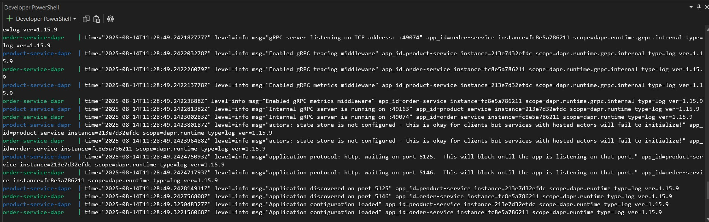

2. Open a browser and navigate to the following URLs to access the Swagger UI for each microservice to test both are working
   - ProductService: [https://localhost:5125/swagger/index.html](https://localhost:5125/swagger/index.html)
   - OrderService: [https://localhost:5146/swagger/index.html](https://localhost:5146/swagger/index.html)
3. In Swagger UI, go to ProductService create endpoint and create a product with the next payload. 
```json
{
  "id": 11,
  "name": "Procuct check communication",
  "price": 1,
  "stock": 3
}
```
4. Both publishing message from Product and consuming message in OrderService should be logged in the terminal: 
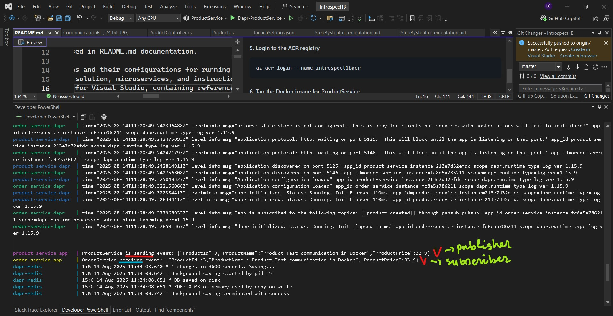

# Deployment on azure
Instead of using Docker Desktop, you can deploy the microservices to Azure Container Registry (ACR) and Azure Container Apps (ACA).

## Deployment to Azure Container Registry (ACR) 
##### 1. Login to azure
```
az login --tenant YOUR_TENANT_ID_
```
##### 2 Create the resource group
```
az group create --name introspect-1-b --location westeurope
```
##### 3. Create the ACR registry
```
az acr create --resource-group introspect-1-b --name introspect1bacr --sku Basic
```

##### 4 Get the ACR login server name
```
az acr show --name introspect1bacr --query loginServer --output table
```
##### 5. Tag the Docker image for ProductService
You need to ensure your local Docker immage exists before tagging it. 
If you have not built the Docker image yet, you can do so by running the following command in the ProductService directory:
```
docker build -t productservice:latest .
```
Then, tag the Docker image for ProductService:
```
docker tag productservice introspect1bacr.azurecr.io/productservice:latest
```

##### 6. Login to the ACR registry
```
az acr login --name introspect1bacr
```

##### 7. Push the Docker image to ACR for ProductService
```
docker push introspect1bacr.azurecr.io/productservice:latest
```
##### 8. Tag the Docker image for OrderService
You need to ensure your local Docker immage exists before tagging it.
If you have not built the Docker image yet, you can do so by running the following command in the OrderService directory:
```
docker build -t orderservice:latest .
```
Then, tag the Docker image for OrderService:
```
docker tag orderservice introspect1bacr.azurecr.io/orderservice:latest
```
##### 9. Push the Docker image to ACR for OrderService
```
docker push introspect1bacr.azurecr.io/orderservice:latest
```

##### 10. Verify the images in ACR
```
az acr repository list --name introspect1bacr --output table
```
Both productservice and orderservice should be listed in the output.

## Deployment to Azure Container Apps (ACA) using Azure Portal

##### 1. Deploy ProductService in ACA
1. Go to azure portal and create a new Azure Container App.
2. Select respurce group `introspect-1-b` 
3. Conteiner App Name: `productservice-app`
4. Click on Create new environment
	- Set the environment name to `my-container-app-env` and select the resource group `introspect-1-b`.
	- Go to Monitoring tab and click Create New Log Analytics Workspace
		- Set the name to `workspace-intospect1b-logs`
		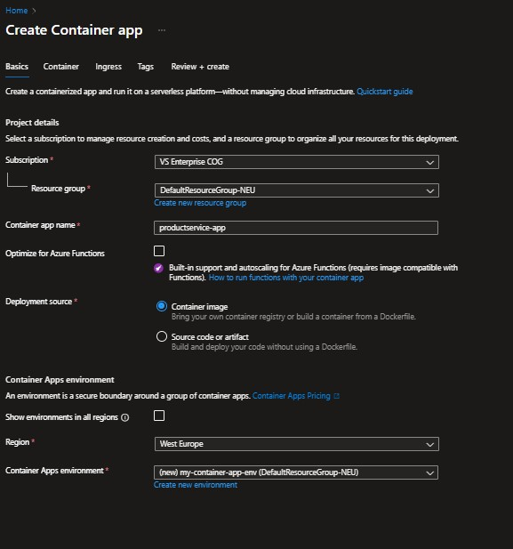
5. In the Container tab
    - Select the container registry `introspect1bacr.azurecr.io`
	- Select image `productservice`
	- Select tag `latest`
	- Authentication type: `Secret`
	- Delpoyment Stack : `.NET`
	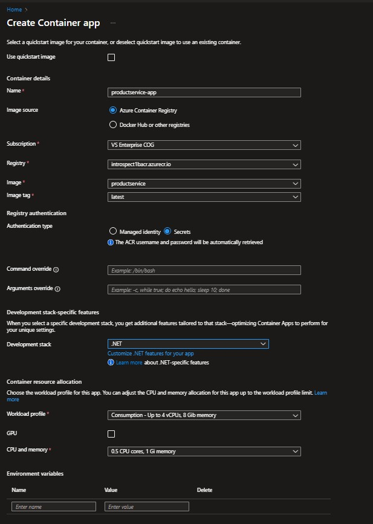
6. Go to Ingress tab
	- Enable ingress
	- Acccept trafic from anyware
	- Target port: `8080`
	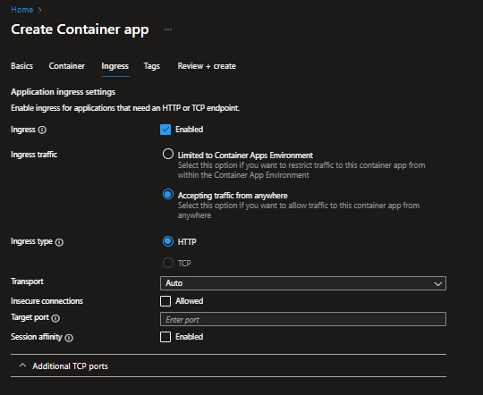
7. Press Review and create, Then Create

8. Check the deployment status in the Azure Portal. 
It may take a few minutes for the Container App to be created and the container to be deployed.
After resource was deployed check your `productservice-app` Container App and make sure it is running:
- Go to the `productservice-app` resource in Azure Portal.
- Copy the URL from the Overview tab and replace `<productappURL>`in the link below
```
<productappURL>/swagger/index.html
```
Your link sould look like this:
```
https://productservice-app.jollypond-a6f1a425.westeurope.azurecontainerapps.io/swagger/index.html
```
- 

##### 2. Deploy OrderService in ACA 
We will use the same environment `my-container-app-env` and Analytics Workspace `workspace-intospect1b-logs` that we created for ProductService.
We will deploy OrderService using the ACR image that we pushed in the previous section.
1. Go to azure portal an select Created Azure Container App Environment `my-container-app-env`
1. go to `Apps` tab and click on `+ Create`
1. Deploy orderservice using the ACR immage by following the steps 5 - 8 from the previous section.

	

##### 3. Provision Redis Cache for Dapr pub/sub
1. Go to azure portal and create a new Azure Cache for Redis.
1. Select resource group `introspect-1-b`
1. Redis Cache: `introspect1b-redis`
1. Location: `westeurope`
1. Pricing tier: `Basic`
1. Go to "Advvanced" tab to change the authentication:
	- enable `Access Keys Authentication` 
	- disable Microsoft Entra ID Authentication	
	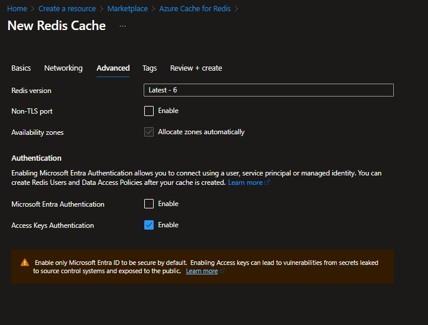
1. Click on `Review + create` and then `Create` to provision the Redis Cache

# Configure Dapr in both ACA apps
##### 1. Configure Dapr pub/sub component for ProductService
1. Go to environment `my-container-app-env` in Azure Portal.
1. Go to `Settings` tab and click on `Dapr Components`
1. Click on `+ Create` to create a new Dapr component.
	- Select Building Block Type: `Pub/Sub`
	- Name: `pubsub`
	- Select Azure Redis Cache host resource `introspect1b-redis` created at preview step
	- Component name: `pubsub`
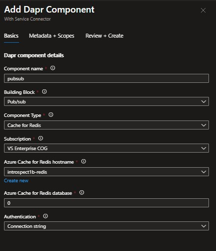
1. Go to the `productservice-app` resource in Azure Portal.
1. Go to `Settings` tab and click on `Dapr`
1. Click on `Enabled` and complete the next info
	- App Id: `productservice`
	- App Port: `8080`
	- Log Level: `Debug`
	- API logging: `Enabled`
1. Save
1. Stop and start the `productservice-app` Container App to apply the changes.
1. Check the logs to ensure that Dapr is running correctly:
	- Go to `Monitoring/LogStream`
	- You should see logs indicating that Dapr is running and listening on port 3500.
	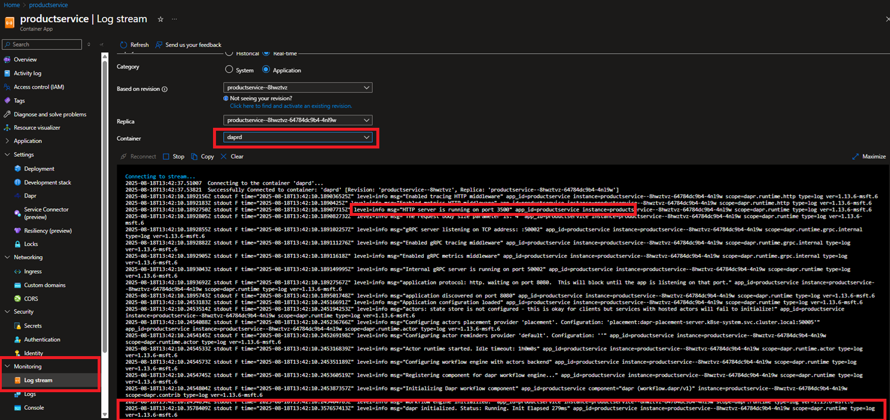

##### 2. Configure Dapr pub/sub component for OrderService
Follow steps 4 - 8 from the previous section to configure Dapr pub/sub component for OrderService.


# Test communication between ProductService and OrderService using Dapr on Azure
You can test the communication between ProductService and OrderService using Dapr by invoking the endpoints defined in the ProductService API.
In Swagger UI, go to create endpoint and create a product.
### Example HTTP Requests for Create a Product
```http
POST https://<productappURL>/api/products
Content-Type: application/json

{
  "id": 100,
  "name": "Procuct check communication Azure",
  "price": 1,
  "stock": 3
}
```
1. The above request creates a new product in the ProductService.
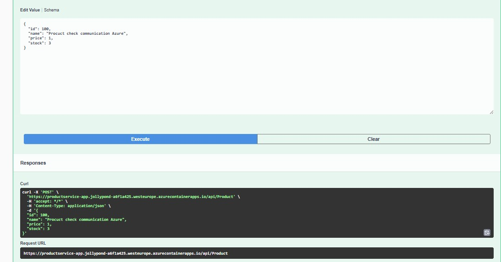
2. After the product is created, the ProductService will publish an event to Dapr pub/sub, which can be consumed by the OrderService 
3. Check the logs frot both services to ensure that the event was published and consumed successfully.
   - In the `productservice-app` logs, you should see a message indicating that a product was created and an event was published.
	 ]
   - In the `orderservice-app` logs, you should see a message indicating that an event was received and processed.
	 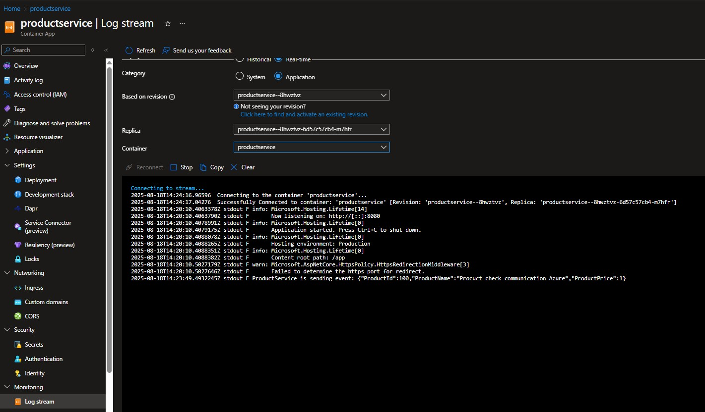